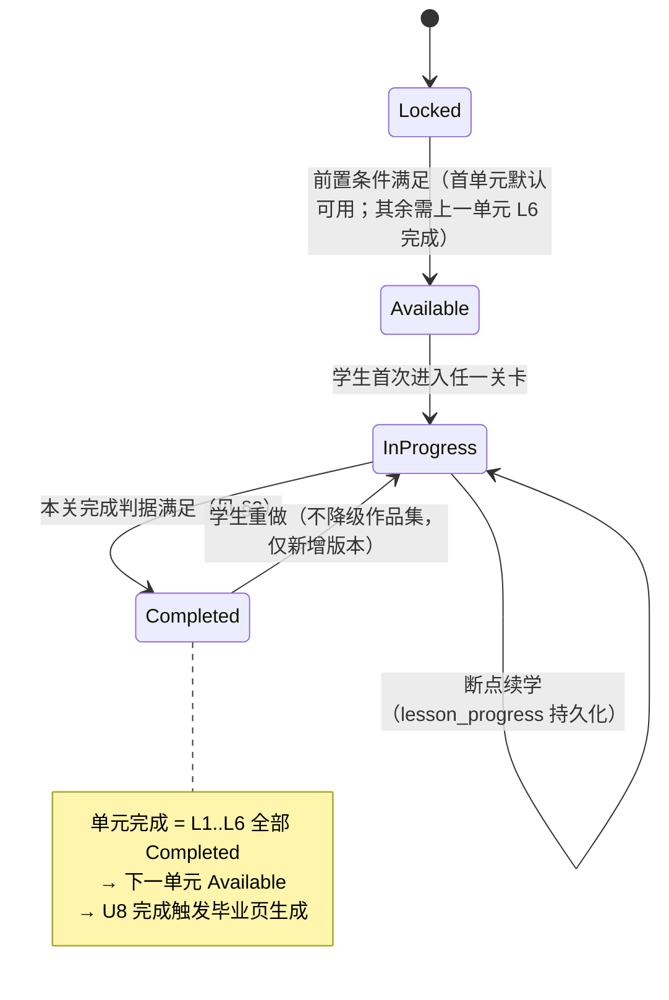
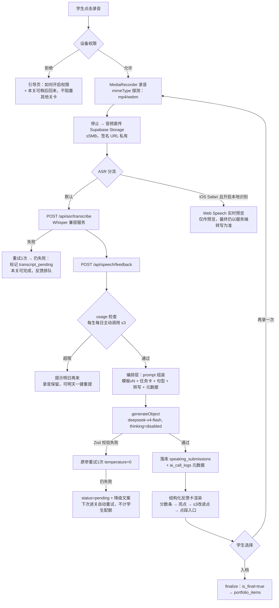
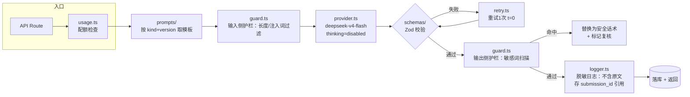
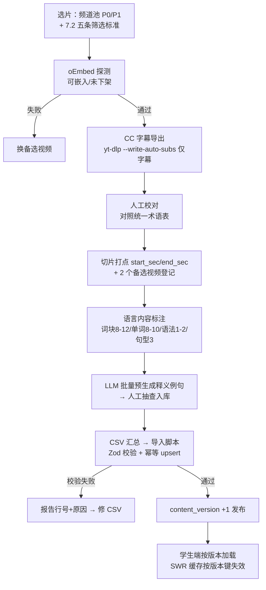
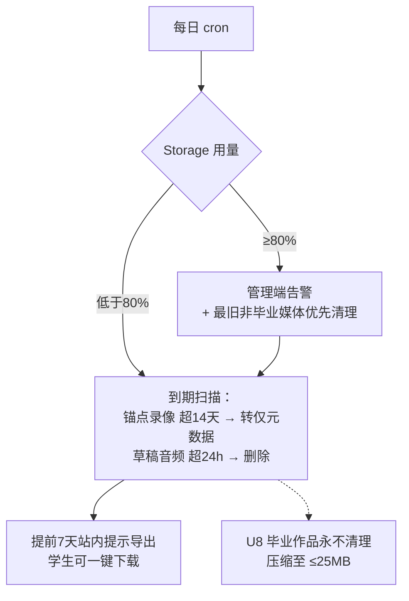
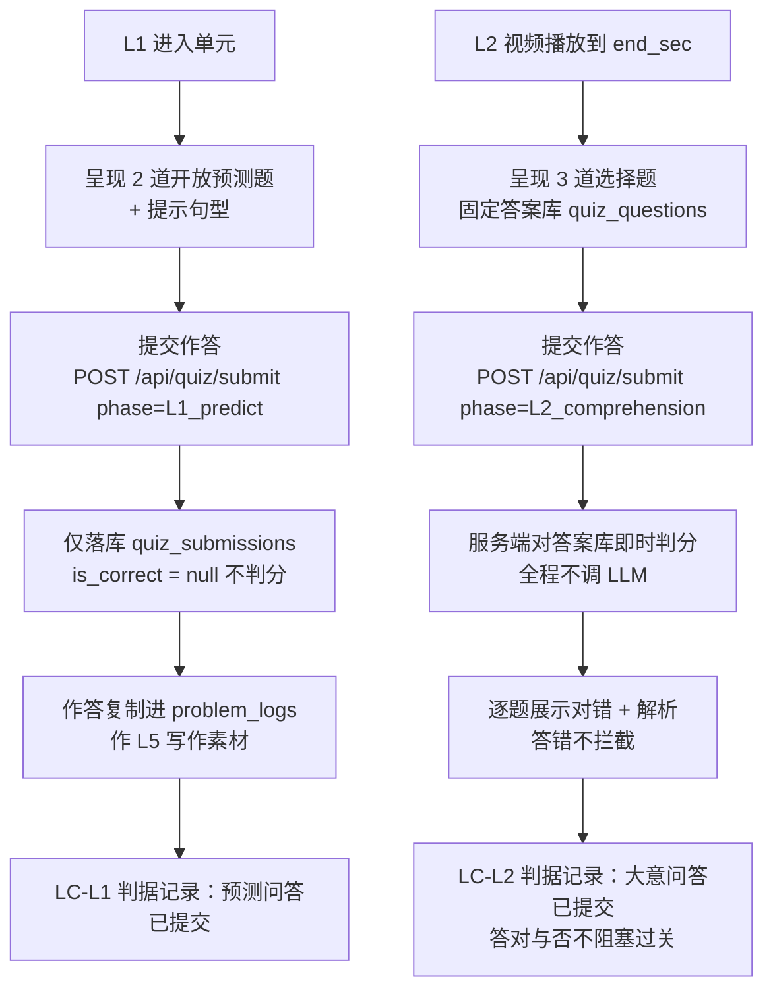
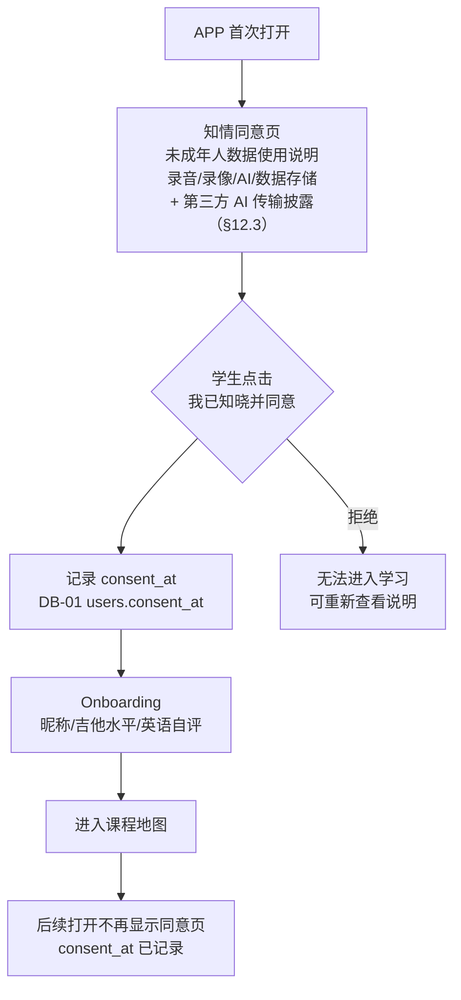

# 流程图与推演

> 配套《教学APP开发需求规格书 v2.4》《审查报告.md》（已归档），所有图使用 Mermaid（GitHub/Typora/VS Code 原生可渲染）。
> 每张图后附**推演**：沿图走一遍正常路径与关键异常路径，验证流程闭环。

---

## 1. 全局：单元/关卡状态机

**推演**
- 正常：U1 默认 Available → L1 进 InProgress → 完成判据满足 → Completed → L2 Available……U1-L6 完成 → U2 Available。
- 异常①：学生 L3 录了一半退出 → `lesson_progress` 记录 step=anchor_record、视频位置、已勾清单 → 重进恢复到同一步（P1）。
- 异常②：学生重做已完成的 L4 → 生成新 `speaking_submissions` 版本，旧版本不删；只有学生显式"选版入档"才改 `is_final`。**重做不会把 Completed 打回 InProgress**（状态机中该转换仅语义标注，前端显示不变）。
- 边界：U8-L6 完成后无下一单元 → 触发毕业页 + 分享链接生成（P1）。

## 2. 各关卡完成判据（补 SRS 缺陷 I-7）

| 关卡 | 完成判据（全部满足） | 不阻塞项 |
|---|---|---|
| L1 | 词块卡全部过一遍（不要求自评档位）＋ 语法操练 2 题提交过 ＋ 预测问答提交 | 自评档位、答对与否 |
| L2 | 视频播放到 end_sec（或手动标记"已看完"）＋ 大意问答提交 ＋ 操作清单勾选 ≥80% | 问答正确率 |
| L3 | 锚点录像（或降级纯音频）上传成功 ＋ 自评 checklist 全勾 ＋ 一句感想提交 | 录像质量、问题日志是否填写 |
| L4 | 至少 1 次录音上传成功 ＋ 转写完成（**或已标记 transcript_pending，与 SRS API-10 对齐**） | **AI 反馈 pending 不阻塞**；选版入档可在反馈到达后补 |
| L5 | 至少 1 版作文提交 ＋ AI 批改已返回（或标记 pending 后学生手动确认"先看下一关"） | 是否按反馈修改 |
| L6 | 确认归档页（单元评估卡 FR-8.4 ＋ 本单元作品集快照）＋ 点击"完成本单元" | 成长曲线加载失败不阻塞 |

> 核心规则：**AI 反馈 pending 只阻塞"入档"，永不阻塞"过关"**（SRS §4 可靠性条款的形式化）。

## 3. 口语任务全链路（含全部降级分支）

**推演**
- 正常路径（目标 < 15s）：上传 2s + Whisper 转写 3s + LLM 5s + 渲染 1s ≈ 11s，达标；iOS 本地预览期间学生已看到转写滚动，感知更短。
- 异常① Android Chrome 大陆环境：E 分流直接走服务端，不触碰 Web Speech（修复 S-1 后的行为）。
- 异常② Whisper 服务挂：F3 后本关仍可完成，反馈 pending；次日进关自动重试（系统重试不占配额，修复 S-5）。
- 异常③ LLM 两次都输出非法 JSON：L 分支，学生看到"反馈稍后送达"，学习流程无中断；管理端看板 JSON 失败率 +1，超 2% 触发模板排查。
- 异常④ 学生当天第 4 次提交：H1 分支，**录音与转写保留**，明天打开一键重提——配额拦截不丢数据。
- 时序预算校验（v2.3 更新）：本地 node 进程无 Serverless 函数时长限制，Whisper + LLM 串行 11s 预算不触限；保留 60s 请求超时兜底降级（`maxDuration = 60`），写进 project_rules.md。

## 4. AI 编排层决策流（lib/ai 内部）

**推演**
- prompt 版本迭代：模板 v2 上线 → 管理端 replay 接口按 `submission_id` 回表取原文（修复 I-6）→ 对 golden 样本集 20 条重放 → 与 v1 结果对比 → 无回退则 `prompt_templates.active` 切到 v2。
- 护栏命中：陪练中学生问无关话题 → 输出侧扫描命中 → 替换为固定转向话术（"Let's get back to music!"），该轮标记进抽检队列。

## 5. 内容生产与发布流（管理员）

**推演**
- 幂等验证：同一 CSV 导入两次 → 第二次全部命中 upsert，无重复行（集成测试覆盖，见《测试方案.md》）。
- 版本灰度：新单元内容 version=3 发布后，进行中学生仍按 version=2 完成当前单元（防中途换题），下一单元起用 v3。

## 6. 存储配额与清理流（修复 S-2 后）

**推演**
- 20 生本地部署最坏情况（v2.3 更新）：14 天窗口 × 2 条/生 × 16MB（700Kbps/540p）≈ 640MB + 毕业作品 20 × 25MB = 500MB → 峰值约 1.1GB。本地 Docker Supabase 磁盘容量取决于主机硬盘，无 1GB 云免费层硬限；80% 磁盘告警 + 14 天清理机制仍保留以维护数据卫生。
- **时区口径（v2.2，NFR-8）**："每日 cron""14 天到期""24h 草稿清理"的日界一律按**北京时间 UTC+8** 计算（固定 +8 偏移，禁用服务器本地时间）；参考实现见《代码示例.md》§10。

## 7. 问答提交流（v2.2 新增，L1 预测问答 / L2 大意问答）

**推演**
- 正常路径全程无 LLM 调用、无 ASR、无媒体上传——是全 APP 最轻的提交链路（预算 < 1s），也是学生感知"即时反馈"的第一触点。
- 异常① 学生跳题直接提交：前端逐题必填校验，未答完提交按钮置灰（完成判据为全部提交，LC-L1）。
- 异常② 网络断线：作答暂存 lesson_progress（step=quiz），重进恢复；已提交题不重答。
- 异常③ 学生全答错 L2 问答：仅展示解析，不弹"不合格"，不阻塞操作清单与过关（核心规则：问答正确率永不作为过关门槛）。
- 边界：管理员更换视频（content_version +1）→ quiz_questions 同版本更新 → 进行中学生锁定旧版本题目完成本单元（与 §5 版本灰度规则一致）。

## 8. 知情同意与首次进入流（v2.4 改写，替代原监护人确认与删除流）

> v2.4 变更：原 §8 监护人确认与账号删除流（v2.2）废止。原因：单用户模式移除全部注册/认证/监护人链路。

**推演**
- 正常：首次打开 → 阅读知情同意 → 点击同意 → onboarding → 课程地图；后续打开直接跳到课程地图。
- 异常① 学生中途想撤回同意：MVP 暂不提供撤回入口；开发者可通过 Docker Supabase 管理界面直接清除 `consent_at` 重置。
- 边界① 设备切换：`consent_at` 存于服务端 DB-01，同一局域网内换设备访问仍读取已同意状态，不重复显示。
- ~~原监护人确认~~/~~删除冷静期~~/~~重发邮件~~：全部废止（FR-1.2/1.5/1.6、API-12~18、AC-10、SEC-4 v2.4 废止）。
